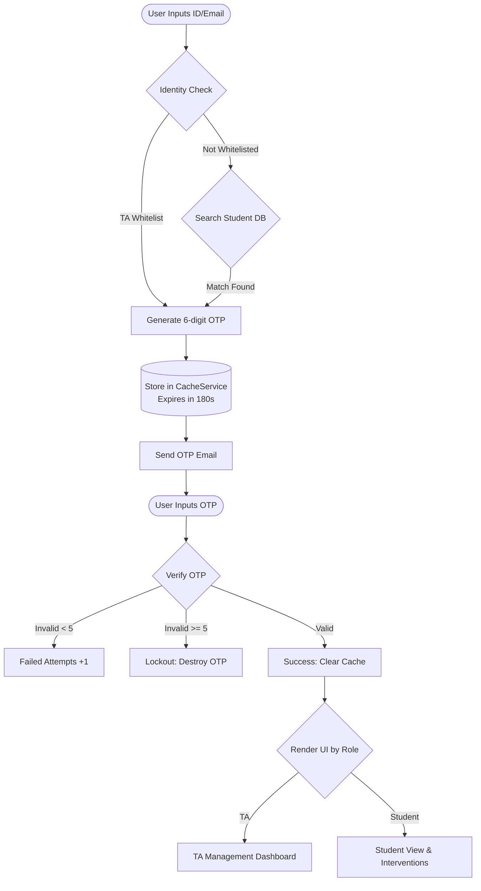

# 🎓 Course Attendance Management System (Serverless Web App)

A lightweight, serverless web application built with **Google Apps Script (GAS)** and **Google Sheets**. 
Developed with a bottom-up approach and AI (LLM) assistance, this project transforms raw spreadsheet data into a secure, fully functional web app featuring Role-Based Access Control (RBAC), OTP passwordless authentication, and automated error-proofing mechanisms.

## 💡 Background & Problem Statement
Traditional attendance tracking often relies on manual verification by Teaching Assistants (TAs) or public spreadsheets, which creates **administrative bottlenecks** and **data privacy risks**.
This system is designed to provide a high-security, low-friction inquiry portal with **zero server and development costs**, leveraging the Google ecosystem.

---

## 🌟 Key Features

- **🔐 Passwordless Authentication (OTP):** Generates and sends a 6-digit One-Time Password to the user's registered email, eliminating the need for password management.
- **👥 Role-Based Access Control (RBAC):**
  - **🧑‍🏫 TA Dashboard:** Displays the full class roster and automatically highlights a "Top 5 Absent Students" high-risk list, empowering proactive classroom management.
  - **👨‍🎓 Student View:** Restricts access to personal attendance records only. Features context-aware UI interventions (e.g., sociological quotes for good attendance, or warning modals for high absences).
- **⏳ Auto-Logout Mechanism:** Implements a 60-second idle timeout that safely logs the user out and clears the screen, preventing data leaks on public/shared computers.
- **🛡️ Rate Limiting & Security:** The system restricts invalid OTP inputs. After 5 consecutive failed attempts, the OTP is forcibly invalidated to prevent brute-force attacks.

---

## 🛠️ Tech Stack

- **Database:** Google Sheets (utilizing the `QUERY` function for data aggregation and automated data validation tests).
- **Backend:** Google Apps Script (GAS).
- **Frontend:** HTML5, CSS3, Vanilla JavaScript.
- **Caching:** Google Apps Script `CacheService` (handles temporary OTP storage with a strict 180-second lifespan).

---

## 📊 System Architecture

The system decouples "Raw Attendance Logs" from "Aggregated Stats". The frontend only interacts with the authentication logic and cache layer. Below is the OTP authentication and login flow:

🚀 Deployment Guide
To deploy this system in your own Google Workspace environment, follow these steps:

1.Database Setup: - Create a Google Sheet with two tabs: Raw Data (原始資料) and Stats (統計資料).
- Populate the sheet matching the required column structures.

2.Import Code: - Open your Google Sheet, navigate to Extensions -> Apps Script.
- Copy and paste the provided Code.gs and Index.html into the respective files.

3.Environment Variables:
- In Code.gs, update the TA_EMAILS array with your actual Teaching Assistant email addresses.

4.Deploy as Web App:
- Click Deploy -> New deployment in the top right corner.
- Select Web app as the type.
- Execute as: Me.
- Who has access: Anyone.
- Click deploy, authorize the necessary permissions, and you will receive your live Web App URL!

